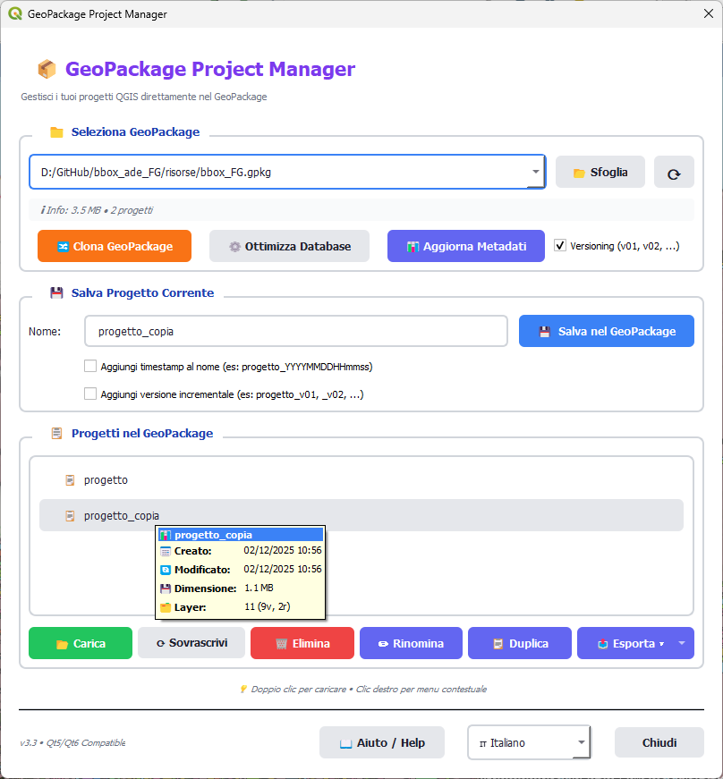

# GeoPackage Project Manager


Plugin QGIS per la gestione completa dei progetti QGIS all'interno di file GeoPackage.

QGIS Plugin for complete management of QGIS projects within GeoPackage files.

## Descrizione / Description

**GeoPackage Project Manager** è un plugin QGIS che permette di salvare, caricare e gestire progetti QGIS direttamente all'interno di file GeoPackage. Sebbene QGIS supporti nativamente il salvataggio di progetti in GeoPackage, non offre funzionalità per rinominarli, duplicarli o eliminarli una volta salvati. Questo plugin colma questa lacuna e aggiunge molte altre funzionalità utili, offrendo un'interfaccia moderna e intuitiva con supporto completo per Qt5 e Qt6.

**GeoPackage Project Manager** is a QGIS plugin that allows you to save, load, and manage QGIS projects directly within GeoPackage files. While QGIS natively supports saving projects in GeoPackage, it doesn't provide functionality to rename, duplicate, or delete them once saved. This plugin fills this gap and adds many other useful features, offering a modern and intuitive interface with full support for Qt5 and Qt6.



## Funzionalità Principali / Main Features

### 🗂️ Gestione Progetti / Project Management
- **Salvataggio progetti** / **Save projects**: Salva il progetto QGIS corrente direttamente nel GeoPackage / Save the current QGIS project directly into the GeoPackage
- **Caricamento progetti** / **Load projects**: Carica progetti salvati con un doppio clic / Load saved projects with a double-click
- **Rinomina progetti** / **Rename projects**: Rinomina i progetti salvati / Rename saved projects
- **Duplica progetti** / **Duplicate projects**: Crea copie dei progetti esistenti / Create copies of existing projects
- **Elimina progetti** / **Delete projects**: Rimuovi progetti non più necessari / Remove projects that are no longer needed
- **Sovrascrivi progetti** / **Overwrite projects**: Aggiorna progetti esistenti con lo stato corrente / Update existing projects with the current state

### 🔢 Versioning e Timestamp / Versioning and Timestamp
- **Timestamp automatico** / **Automatic timestamp**: Aggiungi automaticamente timestamp ai nomi dei progetti (formato: YYYYMMDDHHmmss) / Automatically add timestamps to project names (format: YYYYMMDDHHmmss)
- **Versioning incrementale** / **Incremental versioning**: Sistema di versioning automatico per progetti (v01, v02, ..., v99) / Automatic versioning system for projects (v01, v02, ..., v99)
- **Versioning GeoPackage clonati** / **Cloned GeoPackage versioning**: Versioning automatico per i GeoPackage clonati / Automatic versioning for cloned GeoPackages
- **Sostituzione intelligente** / **Smart replacement**: Sostituisce automaticamente timestamp e versioni esistenti invece di accumularli / Automatically replaces existing timestamps and versions instead of accumulating them
- **Impostazioni persistenti** / **Persistent settings**: Le preferenze di timestamp e versioning vengono salvate tra le sessioni / Timestamp and versioning preferences are saved between sessions

### 📤 Esportazione / Export
- **Esporta in QGS** / **Export to QGS**: Esporta progetti in formato QGIS non compresso / Export projects in uncompressed QGIS format
- **Esporta in QGZ** / **Export to QGZ**: Esporta progetti in formato QGIS compresso / Export projects in compressed QGIS format

### 🔀 Clonazione Intelligente / Smart Cloning
- **Clona GeoPackage** / **Clone GeoPackage**: Crea una copia completa del GeoPackage / Create a complete copy of the GeoPackage
- **Aggiornamento automatico percorsi** / **Automatic path update**: I percorsi dei layer vengono automaticamente aggiornati per puntare al nuovo GeoPackage clonato / Layer paths are automatically updated to point to the new cloned GeoPackage
- Ideale per creare backup o condividere progetti completi / Ideal for creating backups or sharing complete projects

### ⚙️ Ottimizzazione Database / Database Optimization
- **Ottimizza GeoPackage** / **Optimize GeoPackage**: Compatta il database SQLite per ridurre dimensioni e migliorare performance / Compact the SQLite database to reduce size and improve performance
- **Info in tempo reale** / **Real-time info**: Visualizza dimensione file e numero progetti aggiornati automaticamente / Display file size and number of projects updated automatically
- **Statistiche dettagliate** / **Detailed statistics**: Mostra spazio risparmiato, percentuale di riduzione e tempo impiegato / Shows space saved, reduction percentage and time elapsed
- **Operazione VACUUM** / **VACUUM operation**: Rimuove spazio inutilizzato e ottimizza le tabelle del database / Removes unused space and optimizes database tables

### 🎨 Interfaccia Moderna / Modern Interface
- Design moderno e pulito / Modern and clean design
- Supporto completo Qt5/Qt6 / Full Qt5/Qt6 support
- Menu contestuale con tasto destro / Right-click context menu
- Rilevamento automatico dei GeoPackage nel progetto corrente / Automatic detection of GeoPackages in the current project
- Feedback visivo e messaggi chiari / Visual feedback and clear messages
- Selettore di lingua integrato / Integrated language selector

## Installazione

### Da QGIS Plugin Manager
1. Apri QGIS
2. Menu **Plugin** → **Gestisci e installa plugin**
3. Cerca "GeoPackage Project Manager"
4. Clicca **Installa**

### Installazione Manuale
1. Scarica il plugin
2. Estrai il contenuto nella directory dei plugin di QGIS:
   - **Windows**: `C:\Users\<username>\AppData\Roaming\QGIS\QGIS3\profiles\default\python\plugins\`
   - **Linux**: `~/.local/share/QGIS/QGIS3/profiles/default/python/plugins/`
   - **macOS**: `~/Library/Application Support/QGIS/QGIS3/profiles/default/python/plugins/`
3. Riavvia QGIS
4. Abilita il plugin da **Plugin** → **Gestisci e installa plugin** → **Installati**

## Utilizzo

### Avvio del Plugin
- Menu **Database** → **GeoPackage Project Manager**
- Oppure clicca l'icona nella toolbar

### Workflow Tipico

#### 1. Seleziona un GeoPackage
Il plugin rileva automaticamente i GeoPackage utilizzati nel progetto corrente. Puoi anche:
- Usare il pulsante **📂 Sfoglia** per selezionare un GeoPackage manualmente
- Usare il pulsante **🔄** per aggiornare la lista

#### 2. Salva il Progetto
1. Inserisci un nome nel campo **Nome**
2. Clicca **💾 Salva nel GeoPackage**
3. Il progetto viene salvato nella tabella `qgis_projects` del GeoPackage

#### 3. Gestisci i Progetti
Dalla lista dei progetti puoi:
- **Doppio clic**: Carica il progetto
- **Tasto destro**: Menu contestuale con tutte le opzioni
- **Pulsanti**: Usa i pulsanti dedicati per ogni azione

#### 4. Clona il GeoPackage
Quando devi creare una copia del GeoPackage:
1. Clicca **🔀 Clona GeoPackage**
2. Scegli il percorso di destinazione
3. Il plugin copia il GeoPackage e aggiorna automaticamente tutti i percorsi nei progetti salvati

## Casi d'Uso

### 📚 Organizzazione Progetti
Mantieni più versioni di un progetto all'interno dello stesso GeoPackage:
```
myproject.gpkg
├── Layer1
├── Layer2
└── Projects:
    ├── versione_2024-01
    ├── versione_2024-02
    └── versione_finale
```

### 🔄 Backup e Versionamento
Crea copie di sicurezza dei tuoi progetti con dati integrati:
1. Salva il progetto nel GeoPackage
2. Duplica il progetto con un nome diverso (es. `progetto_backup_2024`)
3. Continua a lavorare sulla versione principale

### 📦 Condivisione Progetti
Condividi progetti completi con colleghi:
1. Salva tutti i dati e il progetto nel GeoPackage
2. Clona il GeoPackage per creare una copia standalone
3. Condividi il singolo file `.gpkg` che contiene tutto

### 🚀 Migrazione tra Ambienti
Sposta progetti tra computer mantenendo i riferimenti corretti:
1. Clona il GeoPackage nella nuova posizione
2. I percorsi vengono aggiornati automaticamente
3. Carica il progetto senza problemi di path

## Compatibilità

- **QGIS**: versione 3.0 e successive
- **Qt**: compatibile con Qt5 e Qt6
- **Sistemi Operativi**: Windows, Linux, macOS
- **GeoPackage**: standard OGC GeoPackage 1.0+
- **Lingue**: Italiano (default), Inglese

## Traduzioni / Translations

Il plugin supporta le seguenti lingue / The plugin supports the following languages:

- 🇮🇹 **Italiano** - Lingua predefinita / Default language
- 🇬🇧 **English** - Available

### Cambiare Lingua / Change Language

Il plugin rileva automaticamente la lingua di QGIS. Per cambiarla:

The plugin automatically detects QGIS language. To change it:

1. **Impostazioni** → **Opzioni** → **Generale** → **Lingua interfaccia utente**
2. **Settings** → **Options** → **General** → **User Interface Translation**
3. Riavvia QGIS / Restart QGIS

### Contribuire con Traduzioni / Contributing Translations

Vuoi tradurre il plugin nella tua lingua? Leggi [i18n/README.md](i18n/README.md) per le istruzioni!

Want to translate the plugin in your language? Read [i18n/README.md](i18n/README.md) for instructions!

## FAQ

**Q: Posso salvare progetti in GeoPackage senza questo plugin?**
A: Sì, QGIS supporta nativamente il salvataggio in GeoPackage, ma questo plugin offre un'interfaccia dedicata e funzionalità avanzate come la clonazione intelligente.

**Q: I progetti salvati sono compatibili con QGIS standard?**
A: Sì, i progetti sono salvati nel formato standard QGIS e possono essere aperti anche senza il plugin.

**Q: Cosa succede quando clono un GeoPackage?**
A: Il plugin crea una copia fisica del file e aggiorna automaticamente tutti i riferimenti ai percorsi nei progetti salvati, permettendo al progetto clonato di funzionare correttamente nella nuova posizione.

**Q: Posso salvare più progetti nello stesso GeoPackage?**
A: Sì, puoi salvare tutti i progetti che vuoi nello stesso GeoPackage. La tabella `qgis_projects` può contenere un numero illimitato di progetti.

## Contribuire

Contributi, segnalazioni di bug e richieste di funzionalità sono benvenuti!

1. Fork del repository
2. Crea un branch per la tua feature (`git checkout -b feature/AmazingFeature`)
3. Commit delle modifiche (`git commit -m 'Add some AmazingFeature'`)
4. Push del branch (`git push origin feature/AmazingFeature`)
5. Apri una Pull Request

## Segnalazione Bug

Per segnalare bug o richiedere nuove funzionalità, apri un issue su:
https://github.com/pigreco/gpkg_project_manager/issues

## Autore

**Salvatore Fiandaca (Totò)**
- Email: pigrecoinfinito@gmail.com
- GitHub: [@pigreco](https://github.com/pigreco)

## Changelog

### v3.2.0 (2025)
- ⚙️ **Ottimizzazione database**: Compatta il GeoPackage con VACUUM SQLite per ridurre dimensioni e migliorare performance
- 📊 **Info GeoPackage in tempo reale**: Visualizza dimensione file e numero progetti aggiornati automaticamente
- 📈 **Statistiche ottimizzazione**: Mostra spazio risparmiato, percentuale di riduzione e tempo impiegato
- 🔧 **Gestione performance**: Rimuove spazio inutilizzato e ottimizza tabelle del database

### v3.1.0 (2025)
- 🔢 **Timestamp automatico**: Aggiungi timestamp ai nomi dei progetti (YYYYMMDDHHmmss)
- 📊 **Versioning incrementale progetti**: Sistema automatico di versioning (v01, v02, ..., v99)
- 🔄 **Versioning GeoPackage clonati**: Versioning automatico per i file clonati
- 💾 **Impostazioni persistenti**: Le preferenze vengono salvate tra le sessioni
- ✨ **Sostituzione intelligente**: Evita l'accumulo di timestamp e versioni duplicate

### v3.0.0 (2025)
- ✨ Interfaccia moderna completamente ridisegnata
- 🔀 Funzionalità di clonazione GeoPackage con aggiornamento automatico percorsi
- 🎯 Supporto completo Qt5/Qt6
- 📤 Esportazione progetti in formato QGS/QGZ
- 🖱️ Menu contestuale per azioni rapide
- 🐛 Miglioramenti alla stabilità e gestione errori
- 📋 Funzioni di duplicazione e rinomina progetti

## Link Utili

- [Repository GitHub](https://github.com/pigreco/gpkg_project_manager)
- [Documentazione QGIS](https://docs.qgis.org/)
- [Specifiche GeoPackage](https://www.geopackage.org/)

## Video Demo

[](https://youtu.be/Fl8hurqrwsw)

*Clicca sull'immagine per guardare il video su YouTube*

---

**Nota**: Questo plugin è distribuito "così com'è", senza garanzie di alcun tipo. Usa a tuo rischio e pericolo.
