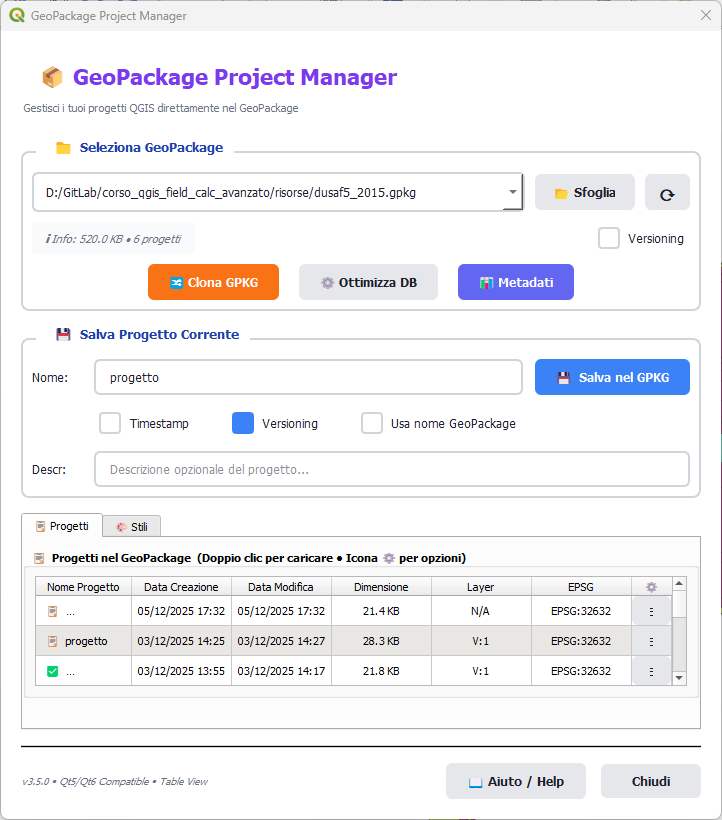

# GeoPackage Project Manager


Plugin QGIS per la gestione completa dei progetti QGIS all'interno di file GeoPackage.

QGIS Plugin for complete management of QGIS projects within GeoPackage files.

## Descrizione / Description

**GeoPackage Project Manager** è un plugin QGIS che permette di salvare, caricare e gestire progetti QGIS direttamente all'interno di file GeoPackage. Sebbene QGIS supporti nativamente il salvataggio di progetti in GeoPackage, non offre funzionalità per rinominarli, duplicarli o eliminarli una volta salvati. Questo plugin colma questa lacuna e aggiunge molte altre funzionalità utili, offrendo un'interfaccia moderna e intuitiva con supporto completo per Qt5 e Qt6.

**GeoPackage Project Manager** is a QGIS plugin that allows you to save, load, and manage QGIS projects directly within GeoPackage files. While QGIS natively supports saving projects in GeoPackage, it doesn't provide functionality to rename, duplicate, or delete them once saved. This plugin fills this gap and adds many other useful features, offering a modern and intuitive interface with full support for Qt5 and Qt6.



## Funzionalità Principali / Main Features

### 🗂️ Gestione Progetti / Project Management
- **Salvataggio progetti** / **Save projects**: Salva il progetto QGIS corrente direttamente nel GeoPackage / Save the current QGIS project directly into the GeoPackage
- **Caricamento progetti** / **Load projects**: Carica progetti salvati con un doppio clic / Load saved projects with a double-click
- **Rinomina progetti** / **Rename projects**: Rinomina i progetti salvati / Rename saved projects
- **Duplica progetti** / **Duplicate projects**: Crea copie dei progetti esistenti / Create copies of existing projects
- **Elimina progetti** / **Delete projects**: Rimuovi progetti non più necessari / Remove projects that are no longer needed
- **Sovrascrivi progetti** / **Overwrite projects**: Aggiorna progetti esistenti con lo stato corrente / Update existing projects with the current state

### 🔢 Versioning e Timestamp / Versioning and Timestamp
- **Timestamp automatico** / **Automatic timestamp**: Aggiungi automaticamente timestamp ai nomi dei progetti (formato: YYYYMMDDHHmmss) / Automatically add timestamps to project names (format: YYYYMMDDHHmmss)
- **Versioning incrementale** / **Incremental versioning**: Sistema di versioning automatico per progetti (v01, v02, ..., v99) / Automatic versioning system for projects (v01, v02, ..., v99)
- **Versioning GeoPackage clonati** / **Cloned GeoPackage versioning**: Versioning automatico per i GeoPackage clonati con checkbox dedicato / Automatic versioning for cloned GeoPackages with dedicated checkbox
- **Usa nome GeoPackage** / **Use GeoPackage name**: Imposta automaticamente il nome del progetto uguale al nome del GeoPackage / Automatically set the project name equal to the GeoPackage name
- **Sostituzione intelligente** / **Smart replacement**: Sostituisce automaticamente timestamp e versioni esistenti invece di accumularli / Automatically replaces existing timestamps and versions instead of accumulating them
- **Impostazioni persistenti** / **Persistent settings**: Le preferenze di timestamp e versioning vengono salvate tra le sessioni / Timestamp and versioning preferences are saved between sessions

### 📤 Esportazione / Export
- **Esporta in QGS** / **Export to QGS**: Esporta progetti in formato QGIS non compresso / Export projects in uncompressed QGIS format
- **Esporta in QGZ** / **Export to QGZ**: Esporta progetti in formato QGIS compresso / Export projects in compressed QGIS format

### 🔀 Clonazione Intelligente / Smart Cloning
- **Clona GeoPackage** / **Clone GeoPackage**: Crea una copia completa del GeoPackage / Create a complete copy of the GeoPackage
- **Aggiornamento automatico percorsi** / **Automatic path update**: I percorsi dei layer vengono automaticamente aggiornati per puntare al nuovo GeoPackage clonato / Layer paths are automatically updated to point to the new cloned GeoPackage
- Ideale per creare backup o condividere progetti completi / Ideal for creating backups or sharing complete projects

### ⚙️ Ottimizzazione Database / Database Optimization
- **Ottimizza GeoPackage** / **Optimize GeoPackage**: Compatta il database SQLite per ridurre dimensioni e migliorare performance / Compact the SQLite database to reduce size and improve performance
- **Info in tempo reale** / **Real-time info**: Visualizza dimensione file e numero progetti aggiornati automaticamente / Display file size and number of projects updated automatically
- **Statistiche dettagliate** / **Detailed statistics**: Mostra spazio risparmiato, percentuale di riduzione e tempo impiegato / Shows space saved, reduction percentage and time elapsed
- **Operazione VACUUM** / **VACUUM operation**: Rimuove spazio inutilizzato e ottimizza le tabelle del database / Removes unused space and optimizes database tables

### 📊 Sistema Metadati / Metadata System
- **Metadati automatici** / **Automatic metadata**: Estrae e salva automaticamente metadati essenziali per ogni progetto / Automatically extracts and saves essential metadata for each project
- **Descrizione progetto** / **Project description**: Campo opzionale per aggiungere note e descrizioni ai progetti / Optional field to add notes and descriptions to projects
- **Popolamento automatico** / **Auto-population**: La descrizione si popola automaticamente quando si seleziona un progetto / Description automatically populates when selecting a project
- **Tabella semplificata** / **Simplified table**: Metadati essenziali (nome, date, EPSG, descrizione) senza campi ridondanti / Essential metadata (name, dates, EPSG, description) without redundant fields
- **Aggiornamento batch** / **Batch update**: Rigenera i metadati (date e EPSG) per tutti i progetti con un solo clic / Regenerate metadata (dates and EPSG) for all projects with a single click
- **Tooltip intelligenti** / **Smart tooltips**: Visualizza informazioni complete al passaggio del mouse sui progetti (include descrizione) / Display complete information when hovering over projects (includes description)
- **Fallback intelligente** / **Smart fallback**: Mostra informazioni base anche per progetti senza metadati completi / Shows basic information even for projects without complete metadata

### 🎨 Gestione Stili / Styles Management
- **Visualizzazione stili** / **View styles**: Visualizza tutti gli stili salvati nella tabella `layer_styles` del GeoPackage / View all styles saved in the GeoPackage `layer_styles` table
- **Applica stili** / **Apply styles**: Applica gli stili ai layer caricati nel progetto corrente con doppio clic o menu / Apply styles to layers loaded in the current project with double-click or menu
- **Esporta stili** / **Export styles**: Esporta stili come file QML per riutilizzo / Export styles as QML files for reuse
- **Gestione completa** / **Complete management**: Rinomina, duplica, imposta come default ed elimina stili / Rename, duplicate, set as default and delete styles
- **Menu opzioni** / **Options menu**: Menu completo per ogni stile (Applica, Esporta, Rinomina, Duplica, Default, Elimina) / Complete menu for each style (Apply, Export, Rename, Duplicate, Default, Delete)
- **Interfaccia integrata a Tab** / **Integrated tab interface**: Accesso diretto con tab dedicato "🎨 Stili" senza aprire finestre separate / Direct access with dedicated "🎨 Styles" tab without opening separate windows
- **Tabella ordinabile** / **Sortable table**: Visualizzazione tabellare con ordinamento per layer, nome, data modifica / Table view with sorting by layer, name, modification date
- **Applicazione automatica** / **Automatic application**: Aggiornamento immediato della mappa dopo applicazione stile / Immediate map update after style application

### 🔗 Gestione Relazioni / Relations Management
- **Visualizzazione completa relazioni** / **Complete relations view**: Visualizza tutte le relazioni tra tabelle del GeoPackage / View all relations between GeoPackage tables
- **Foreign Keys (FK)** / **Foreign Keys (FK)**: Mostra le foreign key definite a livello database / Shows foreign keys defined at database level
- **GeoPackage Extension** / **GeoPackage Extension**: Visualizza relazioni dalla tabella `gpkgext_relations` / View relations from `gpkgext_relations` table
- **Relazioni di Progetto QGIS** / **QGIS Project Relations**: Mostra le relazioni definite nel progetto QGIS selezionato / Shows relations defined in the selected QGIS project
  - **Estrazione automatica** / **Automatic extraction**: Legge le relazioni dal progetto salvato nel GeoPackage / Reads relations from the project saved in the GeoPackage
  - **Tipo relazione** / **Relation type**: Mostra se la relazione è Association (debole) o Composition (forte con cascata) / Shows if the relation is Association (weak) or Composition (strong with cascade)
  - **Cardinalità** / **Cardinality**: Visualizza la cardinalità della relazione (es. 1:N) / Displays the relation cardinality (e.g. 1:N)
  - **Decodifica HEX** / **HEX decoding**: Supporto progetti salvati come stringa esadecimale / Support for projects saved as hexadecimal string
  - **Anti-duplicati** / **Anti-duplicates**: Filtro automatico per relazioni duplicate / Automatic filter for duplicate relations
- **Interfaccia integrata a Tab** / **Integrated tab interface**: Accesso diretto con tab dedicato "🔗 Relazioni" / Direct access with dedicated "🔗 Relations" tab
- **Tabella dettagliata** / **Detailed table**: 6 colonne con Nome Relazione, Tabelle, Campi e Tipo / 6 columns with Relation Name, Tables, Fields and Type
- **Contatore intelligente** / **Smart counter**: Mostra numero totale e dettaglio per tipo (FK: X, GPKG: Y, Progetto: Z) / Shows total number and detail by type (FK: X, GPKG: Y, Project: Z)
- **Aggiornamento automatico** / **Automatic update**: Le relazioni si aggiornano quando si seleziona un progetto / Relations update when selecting a project
- **Pulsante Aggiorna** / **Refresh button**: Ricarica manualmente le relazioni con il pulsante "⟳ Aggiorna" / Manually reload relations with "⟳ Refresh" button

### 🎨 Interfaccia Moderna / Modern Interface
- **Interfaccia a Tab** / **Tabbed interface**: Navigazione fluida tra Progetti, Stili e Relazioni con tab dedicati / Smooth navigation between Projects, Styles and Relations with dedicated tabs
  - **Tab "📋 Progetti"**: Gestione completa progetti GeoPackage / Complete GeoPackage project management
  - **Tab "🎨 Stili"**: Gestione stili integrata / Integrated styles management
  - **Tab "🔗 Relazioni"**: Visualizzazione relazioni tra tabelle / Relations between tables visualization
- **Doppia interfaccia disponibile** / **Dual interface available**:
  - **Lista verticale** (`dialogs.py`): Design classico con lista progetti / Classic design with project list
  - **Tabella a colonne** (`dialogs_table.py`): Vista moderna con metadati in colonne e tab integrati / Modern view with metadata in columns and integrated tabs
- Design moderno e pulito / Modern and clean design
- Supporto completo Qt5/Qt6 / Full Qt5/Qt6 support
- Menu contestuale con tasto destro / Right-click context menu
- Rilevamento automatico dei GeoPackage nel progetto corrente / Automatic detection of GeoPackages in the current project
- Feedback visivo e messaggi chiari / Visual feedback and clear messages
- Ordinamento colonne cliccabile (interfaccia tabella) / Clickable column sorting (table interface)
- Colonne ridimensionabili (interfaccia tabella) / Resizable columns (table interface)
- Indicatore progetto corrente con ✅ / Current project indicator with ✅

## Installazione

### Da QGIS Plugin Manager
1. Apri QGIS
2. Menu **Plugin** → **Gestisci e installa plugin**
3. Cerca "GeoPackage Project Manager"
4. Clicca **Installa**

### Installazione Manuale
1. Scarica il plugin
2. Estrai il contenuto nella directory dei plugin di QGIS:
   - **Windows**: `C:\Users\<username>\AppData\Roaming\QGIS\QGIS3\profiles\default\python\plugins\`
   - **Linux**: `~/.local/share/QGIS/QGIS3/profiles/default/python/plugins/`
   - **macOS**: `~/Library/Application Support/QGIS/QGIS3/profiles/default/python/plugins/`
3. Riavvia QGIS
4. Abilita il plugin da **Plugin** → **Gestisci e installa plugin** → **Installati**

## Utilizzo

### Avvio del Plugin
- Menu **Database** → **GeoPackage Project Manager**
- Oppure clicca l'icona nella toolbar

### Workflow Tipico

#### 1. Seleziona un GeoPackage
Il plugin rileva automaticamente i GeoPackage utilizzati nel progetto corrente. Puoi anche:
- Usare il pulsante **📂 Sfoglia** per selezionare un GeoPackage manualmente
- Usare il pulsante **🔄** per aggiornare la lista

#### 2. Salva il Progetto
1. Inserisci un nome nel campo **Nome**
2. Clicca **💾 Salva nel GeoPackage**
3. Il progetto viene salvato nella tabella `qgis_projects` del GeoPackage

#### 3. Gestisci i Progetti
Dalla lista dei progetti puoi:
- **Doppio clic**: Carica il progetto
- **Tasto destro**: Menu contestuale con tutte le opzioni
- **Pulsanti**: Usa i pulsanti dedicati per ogni azione

#### 4. Visualizza Metadati Progetti
Passando il mouse sui progetti nella lista:
- **Tooltip con metadati completi**: Mostra data creazione/modifica, dimensione, numero layer (vettoriali/raster)
- **Tooltip base**: Per progetti senza metadati completi, mostra almeno la dimensione

#### 5. Aggiorna Metadati
Per rigenerare i metadati di tutti i progetti:
1. Clicca **📊 Aggiorna Metadati**
2. Conferma l'operazione
3. Il plugin estrae automaticamente i metadati da tutti i progetti salvati
4. I tooltip mostreranno ora informazioni complete

#### 6. Clona il GeoPackage
Quando devi creare una copia del GeoPackage:
1. Clicca **🔀 Clona GeoPackage**
2. Scegli il percorso di destinazione
3. Il plugin copia il GeoPackage e aggiorna automaticamente tutti i percorsi nei progetti salvati

#### 7. Gestisci gli Stili
Per visualizzare e gestire gli stili salvati nel GeoPackage:
1. Clicca **🎨 Stili** nella finestra principale
2. La tabella mostra tutti gli stili presenti nella tabella `layer_styles`
3. Puoi:
   - **Doppio clic su uno stile**: Applica lo stile al layer corrispondente (se caricato nel progetto)
   - **Menu contestuale ⚙️**: Accedi a tutte le opzioni di gestione
   - **🎨 Applica**: Applica lo stile al layer nel progetto corrente
   - **💾 Esporta QML**: Esporta lo stile come file QML
   - **✏️ Rinomina**: Cambia il nome dello stile
   - **📋 Duplica**: Crea una copia dello stile
   - **⭐ Imposta come default**: Imposta lo stile come predefinito per il layer
   - **🗑️ Elimina**: Rimuovi definitivamente lo stile

## Casi d'Uso

### 📚 Organizzazione Progetti
Mantieni più versioni di un progetto all'interno dello stesso GeoPackage:
```
myproject.gpkg
├── Layer1
├── Layer2
└── Projects:
    ├── versione_2024-01
    ├── versione_2024-02
    └── versione_finale
```

### 🔄 Backup e Versionamento
Crea copie di sicurezza dei tuoi progetti con dati integrati:
1. Salva il progetto nel GeoPackage
2. Duplica il progetto con un nome diverso (es. `progetto_backup_2024`)
3. Continua a lavorare sulla versione principale

### 📦 Condivisione Progetti
Condividi progetti completi con colleghi:
1. Salva tutti i dati e il progetto nel GeoPackage
2. Clona il GeoPackage per creare una copia standalone
3. Condividi il singolo file `.gpkg` che contiene tutto

### 🚀 Migrazione tra Ambienti
Sposta progetti tra computer mantenendo i riferimenti corretti:
1. Clona il GeoPackage nella nuova posizione
2. I percorsi vengono aggiornati automaticamente
3. Carica il progetto senza problemi di path

## Compatibilità

- **QGIS**: versione 3.0 e successive
- **Qt**: compatibile con Qt5 e Qt6
- **Sistemi Operativi**: Windows, Linux, macOS
- **GeoPackage**: standard OGC GeoPackage 1.0+
- **Lingue**: Italiano (default), Inglese

## Traduzioni / Translations

Il plugin supporta le seguenti lingue / The plugin supports the following languages:

- 🇮🇹 **Italiano** - Lingua predefinita / Default language
- 🇬🇧 **English** - Available

### Cambiare Lingua / Change Language

Il plugin rileva automaticamente la lingua di QGIS. Per cambiarla:

The plugin automatically detects QGIS language. To change it:

1. **Impostazioni** → **Opzioni** → **Generale** → **Lingua interfaccia utente**
2. **Settings** → **Options** → **General** → **User Interface Translation**
3. Riavvia QGIS / Restart QGIS

### Contribuire con Traduzioni / Contributing Translations

Vuoi tradurre il plugin nella tua lingua? Leggi [i18n/README.md](i18n/README.md) per le istruzioni!

Want to translate the plugin in your language? Read [i18n/README.md](i18n/README.md) for instructions!

## FAQ

**Q: Posso salvare progetti in GeoPackage senza questo plugin?**
A: Sì, QGIS supporta nativamente il salvataggio in GeoPackage, ma questo plugin offre un'interfaccia dedicata e funzionalità avanzate come la clonazione intelligente.

**Q: I progetti salvati sono compatibili con QGIS standard?**
A: Sì, i progetti sono salvati nel formato standard QGIS e possono essere aperti anche senza il plugin.

**Q: Cosa succede quando clono un GeoPackage?**
A: Il plugin crea una copia fisica del file e aggiorna automaticamente tutti i riferimenti ai percorsi nei progetti salvati, permettendo al progetto clonato di funzionare correttamente nella nuova posizione.

**Q: Posso salvare più progetti nello stesso GeoPackage?**
A: Sì, puoi salvare tutti i progetti che vuoi nello stesso GeoPackage. La tabella `qgis_projects` può contenere un numero illimitato di progetti.

## Contribuire

Contributi, segnalazioni di bug e richieste di funzionalità sono benvenuti!

### Per Sviluppatori
Prima di contribuire, consulta:
- 📋 **[DEVELOPMENT_CHECKLIST.md](DEVELOPMENT_CHECKLIST.md)**: Checklist complete per sviluppo e release
- ⚡ **[.github/QUICK_REFERENCE.md](.github/QUICK_REFERENCE.md)**: Promemoria rapido

### Workflow Contributi
1. Fork del repository
2. Crea un branch per la tua feature (`git checkout -b feature/AmazingFeature`)
3. Segui la [Development Checklist](DEVELOPMENT_CHECKLIST.md)
4. Commit delle modifiche (`git commit -m 'feat: add some AmazingFeature'`)
5. Push del branch (`git push origin feature/AmazingFeature`)
6. Apri una Pull Request

## Segnalazione Bug

Per segnalare bug o richiedere nuove funzionalità, apri un issue su:
https://github.com/pigreco/gpkg_project_manager/issues

## Autore

**Salvatore Fiandaca (Totò)**
- Email: pigrecoinfinito@gmail.com
- GitHub: [@pigreco](https://github.com/pigreco)

## Changelog

Per il changelog completo e dettagliato, consulta il file [CHANGELOG.md](CHANGELOG.md).

### v3.7.1 (2025-12-20)
- 🔧 **Indicatore protezione visibile**: Aggiunto indicatore stato protezione sulla riga "ℹ️ Info"
  - Mostra stato in tempo reale: `🔒 Protezione: ATTIVA ✅` / `🔓 DISATTIVATA` / `⚠️ PARZIALE`
  - Pulsante ⚙️ per accesso rapido al menu gestione
- 🎯 **UX migliorata**: Menu protezione ora a livello GeoPackage (semanticamente corretto)
- 📝 **Documentazione**: Chiarito che la protezione vale per TUTTO il GeoPackage

### v3.7.0 (2025-12-20)
- 🎉 **Sistema di Protezione con Trigger SQLite**: Protezione automatica dei progetti
  - Trigger automatici che impediscono UPDATE e DELETE non autorizzati
  - Protezione trasparente e universale (funziona anche contro strumenti esterni)
  - Menu "🔒 Gestione Protezione" con stato, disabilitazione temporanea e ripristino
- 🔐 **Sicurezza**: Protezione a livello database, blocco modifiche esterne, versioning forzato
- 📚 **Documentazione completa**: TRIGGERS_PROTECTION.md, README_TRIGGERS.md, test_triggers.py
- ⚡ **Prestazioni**: Overhead minimo, nessun impatto su SELECT/INSERT

### v3.6.0 (2025-12-06)
- 🎉 **Tab "🔗 Relazioni"**: Visualizzazione completa relazioni tra tabelle
  - Foreign Keys (FK), GeoPackage Extension, Relazioni di Progetto QGIS
  - Estrazione automatica dal progetto con supporto HEX
  - Mostra tipo (Association/Composition) e cardinalità (1:N)
- 🔧 **Popolamento automatico descrizione**: Campo descrizione si popola quando si seleziona un progetto
- 📊 **Tabelle semplificate**: Rimosse colonne non essenziali per vista più pulita

### v3.5.0 (2025-12-05)
- 🎉 **Interfaccia a Tab**: Navigazione fluida tra "📋 Progetti" e "🎨 Stili"
- 🎨 **Gestione Stili integrata**: Applica, esporta, rinomina, duplica, imposta default ed elimina stili
- ✨ **UX migliorata**: Tutto in un'unica finestra, senza dialog separati

### v3.4.2 (2025-12-05)
- ✅ **Checkbox "Usa nome GeoPackage"**: Imposta nome progetto uguale al GeoPackage
- 📝 **Campo Descrizione**: Descrizione opzionale per progetti con tooltip informativo

### v3.4.1 (2025-12-04)
- 🎯 **Colonna EPSG**: Sistema di riferimento (CRS) visualizzato nella tabella
- 📊 **Dettaglio conteggio layer**: Mostra V:3 R:2 T:1 (Vettoriali, Raster, Tabelle)

### v3.4.0 (2025-12-04)
- 🎨 **Gestione Stili Layer**: Visualizza e gestisce stili dalla tabella `layer_styles` (OGC)
- 🌍 **Traduzioni**: 56 nuove stringhe tradotte in inglese

### v3.3.2 (2025-12-03)
- 🛠️ **Gestione date**: Data modifica aggiornata SOLO quando si sovrascrive un progetto

### v3.3.1 (2025-12-02)
- 🛠️ **Bug fix critici**: Corretti 6 bug (rinomina, duplicazione, flag is_new, test traduzione, reset dialog)

### v3.3.0 (2025-12-02)
- 📊 **Sistema metadati completo**: Estrazione automatica metadati dettagliati
- 💡 **Tooltip intelligenti**: Info complete al passaggio del mouse
- 🔄 **Aggiornamento batch**: Rigenera tutti i metadati con un clic

### v3.2.0 (2025)
- ⚙️ **Ottimizzazione database**: VACUUM SQLite per ridurre dimensioni e migliorare performance
- 📊 **Info in tempo reale**: Dimensione file e numero progetti sempre aggiornati

### v3.1.0 (2025)
- 🔢 **Timestamp automatico**: Aggiungi timestamp ai nomi (YYYYMMDDHHmmss)
- 📊 **Versioning incrementale**: Sistema automatico (v01, v02, ..., v99)
- 💾 **Impostazioni persistenti**: Preferenze salvate tra le sessioni

### v3.0.0 (2025)
- ✨ **Interfaccia moderna**: Design completamente ridisegnato
- 🔀 **Clonazione GeoPackage**: Con aggiornamento automatico percorsi
- 🎯 **Supporto Qt5/Qt6**: Compatibilità completa
- 📤 **Esportazione**: Formato QGS/QGZ

## Link Utili

- [Repository GitHub](https://github.com/pigreco/gpkg_project_manager)
- [Documentazione QGIS](https://docs.qgis.org/)
- [Specifiche GeoPackage](https://www.geopackage.org/)

## Video Demo

[](https://youtu.be/Fl8hurqrwsw)

*Clicca sull'immagine per guardare il video su YouTube*

---

NOTE:

- Questo plugin è distribuito "così com'è", senza garanzie di alcun tipo. Usa a tuo rischio e pericolo.
- L'intero plugin è stato sviluppato con _**Claude Code Opus 4.5**_.
